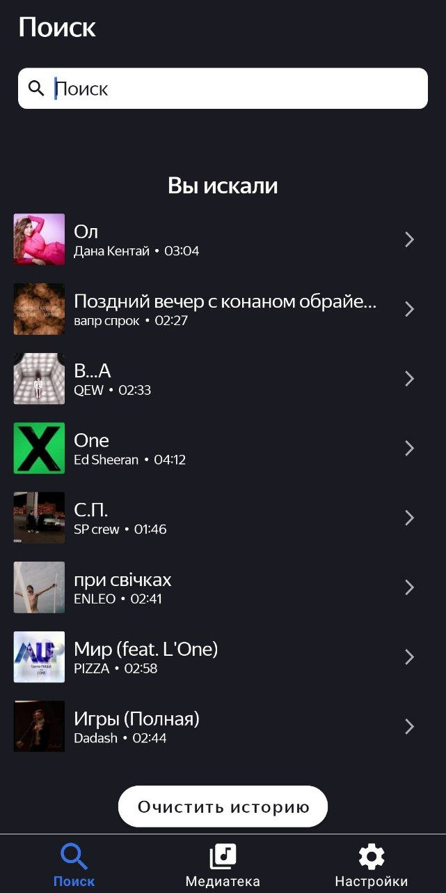
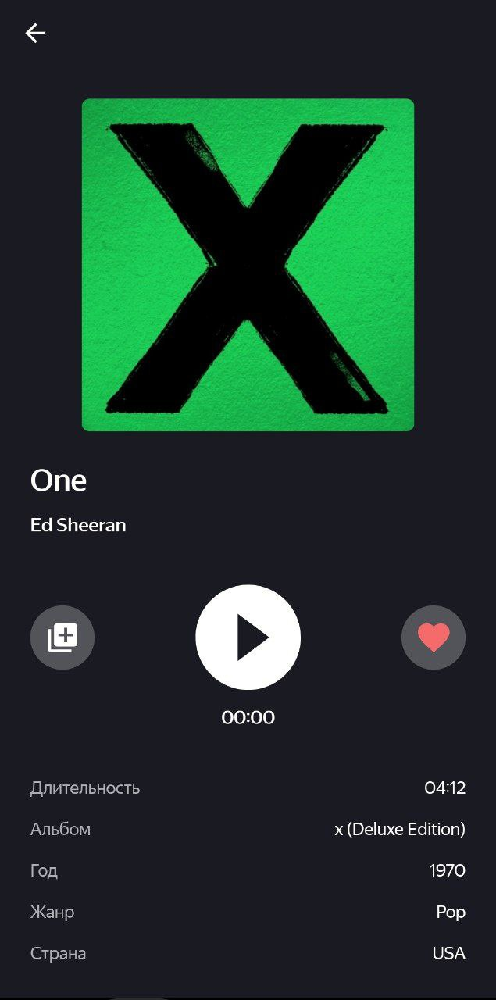
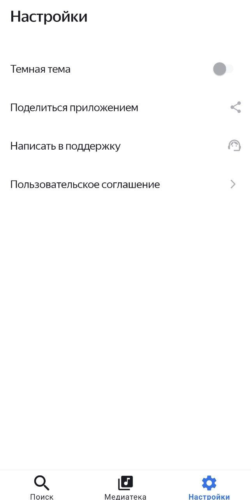

# PlaylistMaker


Музыкальное приложение для поиска треков, создания плейлистов и прослушивания музыки через iTunes API. !!!Внимание. Приложение создано в целях обучения. Используется предварительный просмотр трека длиной 30 секунд.

## 🎵 Оглавление

- [О проекте](#-о-проекте)
- [Функциональности](#-функциональности)
- [Скриншоты](#-скриншоты)
- [Технологии](#-технологии)
- [Установка и запуск](#-установка-и-запуск)
- [Структура проекта](#-структура-проекта)
- [Архитектура](#-архитектура)
- [API](#-api)

## 📖 О проекте

PlaylistMaker - это современное Android-приложение для любителей музыки, позволяющее:

*   **Искать музыкальные треки** по обширной базе данных iTunes
*   **Создавать персонализированные плейлисты** с любимыми композициями
*   **Добавлять треки в избранное** для быстрого доступа
*   **Прослушивать превью треков** с полнофункциональным плеером
*   **Настраивать внешний вид** с поддержкой темной темы

**Целевая аудитория:** Пользователи Android, которые хотят организовывать свою музыкальную коллекцию и открывать новую музыку.

## 🎯 Функциональности

### 🔍 Поиск музыки
*   Поиск треков, альбомов и исполнителей через iTunes API
*   История поиска с возможностью очистки
*   Обработка ошибок сети и пустых результатов

### 🎵 Аудиоплеер
*   Воспроизведение превью треков
*   Красивый интерфейс с обложкой трека
*   Информация о треке: длительность, альбом, жанр, страна
*   Управление воспроизведением (play/pause)

### ❤️ Избранное
*   Добавление треков в избранное
*   Просмотр списка любимых композиций
*   Локальное хранение избранных треков

### 📝 Создание плейлистов
*   Создание пользовательских плейлистов
*   Добавление обложки, названия и описания
*   Добавление треков в плейлисты
*   Управление плейлистами (редактирование, удаление)

### ⚙️ Настройки
*   Переключение между светлой и темной темой
*   Функции "Поделиться приложением" и "Поддержка"
*   Пользовательское соглашение

## 🖼️ Скриншоты

| Поиск | Плеер | Плейлисты | Настройки |
|-------|-------|-----------|-----------|
|  |  |  |  |

## 🛠 Технологии

### Языки и платформы
*   **Kotlin** - основной язык программирования
*   **Android SDK** - минимальная версия: API 29 (Android 10)
*   **Target SDK** - 35

### Архитектура и компоненты
*   **ViewBinding** - для безопасного доступа к views
*   **Navigation Component** - для навигации между фрагментами
*   **ViewModel** + **LiveData** - для управления UI-состоянием
*   **Room** - для локального хранения данных
*   **RecyclerView** - для отображения списков

### Сетевые запросы и данные
*   **Retrofit** - для работы с iTunes API
*   **Gson** - для парсинга JSON-ответов
*   **iTunes Search API** - источник музыкальных данных

### UI/UX
*   **Material Design 3** - современный дизайн
*   **BottomSheet** - для всплывающих окон
*   **ViewPager2** + **TabLayout** - для вкладок
*   **CoordinatorLayout** - для сложных анимаций

### Медиа
*   **Glide** - для загрузки и кэширования изображений
*   **MediaPlayer** - для воспроизведения аудио

## 📦 Установка и запуск

### Предварительные требования
*   Android Studio Arctic Fox или новее
*   JDK 11
*   Android SDK 29+
*   Интернет-соединение для доступа к iTunes API

### Инструкция по запуску

1. **Клонируйте репозиторий:**
   ```bash
   git clone https://github.com/YanaKudrinskaya/PlaylistMaker.git
   cd playlistmaker
2. Откройте проект в Android Studio:

   File → Open → выберите папку проекта

3. Дождитесь синхронизации Gradle

4. Соберите проект:

   Build → Make Project

5. Запустите на эмуляторе или устройстве:

   Выберите устройство и нажмите "Run"

**Конфигурация сборки**
   Проект использует современный подход с файлом libs.versions.toml для управления зависимостями.

## 📁 Структура проекта
```
app/
├── src/main/
│   ├── java/com/yanakudrinskaya/playlistmaker/
│   │   ├── root/                    # Корневая активность
│   │   ├── search/                  # Поиск треков
│   │   │   ├── ui/fragment/        # Фрагмент поиска
│   │   │   ├── domain/             # Use cases
│   │   │   └── data/               # Репозитории, API
│   │   ├── player/                 # Аудиоплеер
│   │   ├── media/                  # Медиа-раздел (вкладки)
│   │   ├── favorite/               # Избранное
│   │   ├── playlists/              # Список плейлистов
│   │   ├── playlist/               # Детали плейлиста
│   │   ├── create_playlist/        # Создание плейлиста
│   │   ├── settings/               # Настройки
│   │   └── App.kt                  # Application класс
│   ├── res/
│   │   ├── layout/                 # XML layouts
│   │   │   ├── fragment_search.xml
│   │   │   ├── fragment_audio_player.xml
│   │   │   ├── fragment_media.xml
│   │   │   ├── fragment_favorite.xml
│   │   │   ├── fragment_playlists.xml
│   │   │   ├── fragment_playlist.xml
│   │   │   ├── fragment_create_playlist.xml
│   │   │   └── fragment_settings.xml
│   │   └── values/                 # Ресурсы
└── build.gradle.kts                # Конфигурация сборки
```
## 🏗 Архитектура

Проект следует принципам **Clean Architecture** и **MVVM**:

```
UI Layer (Fragments/Views)
         ↑
ViewModel (UI State Management)
         ↑
Domain Layer (Use Cases)
         ↑
Data Layer (Repositories)
         ↑
Local (Room) ←→ Remote (Retrofit + iTunes API)
```

**Описание слоев:**
- **UI Layer**: Фрагменты, активити, кастомные вью
- **ViewModel**: Управление состоянием UI, обработка событий  
- **Domain Layer**: Бизнес-логика, use cases, entities
- **Data Layer**: Репозитории, координация источников данных
- **Local**: Room Database для локального хранения
- **Remote**: Retrofit + iTunes API для сетевых запросов

## 🔗 API
Приложение использует iTunes Search API для получения данных о музыке:

*   Базовый URL: https://itunes.apple.com
*   Эндпоинт поиска: /search
*   Параметры: term, media, limit
*   Пример: https://itunes.apple.com/search?term=rock&media=music&limit=50

Возвращаемые данные:

*   Информация о треках
*   URL превью треков
*   Обложки альбомов
*   Метаданные (жанр, страна, дата релиза)

⭐ Поставьте звезду репозиторию, если проект вам понравился!
